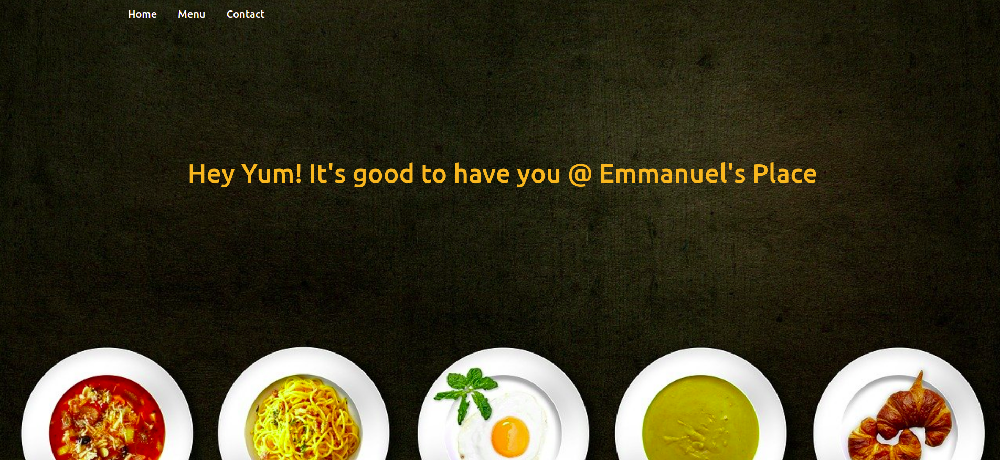

# Restaurant Page

A simple restaurant page built using Vanilla Javascript to generate its entire content.

## Live Demo

[Live Demo Link](https://raw.githack.com/Abidoyinsola1/Restaurant-Page/feature/dist/index.html)

## Built With

- Javascript
- HTML & CSS3
- Bootstrap

## Prerequisites

- Node
- Get a browser like Chrome and Firefox in their most recent versions

### Setup

- Clone the repository on your local machine
- cd into the folder
- npm install
- npm run build
- Open the dist/index.html file in any web browser of your choosing.

## Author

👤 **Adeyemi Abiola Doyinsola**

- Github: [@Abidoyinsola1](https://github.com/Abidoyinsola1)
- Twitter: [@Abidoyinsola](https://twitter.com/abidoyinsola)
- LinkedIn: [Doyinsola Abiola Adeyemi](https://www.linkedin.com/in/doyinsola-adeyemi)

## 🤝 Contributing

Contributions, issues and feature requests are welcome!

## Show your support

Give a ⭐️ if you like this project!
